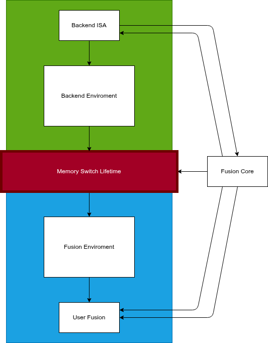
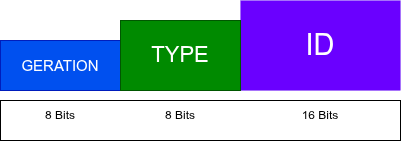

# Fusion Handles System

Do podereso mundo de troca de contexto, fizemos esta arquitetura pensando e troca zero-copy de buffer e dados entre o Backend(ISA Define) e corpo central *Fusion Core*, sendo apenas uma troca simples de life-time.

## - Description

Baseado na forma de Kernel Unix de ser comportar o sistema funciona utilizando handles para troca de contexto, com apenas uma fonte real de dados centrais, ambos o sistemas alocam no mesmo serviço de memoria, mas cada um possui seu devido direito de life-time, onde o sistema de handles entra em jogo, para possibilitar a mundaça de novo entre ambos os *Consumidore/Produtores*.

### - Handle Sets

| Bits | Campo | Descrição |
|------|-------|------------|
| 24-31 | GENERATION (8 bits) | Incrementa cada vez que o slot é reusado. Detecta use-after-free. |
| 16-23 | TYPE (8 bits) | Identifica o tipo do objeto (ex: 1=backend, 2=buffer, 3=symbol). |
| 0-15 | ID (16 bits) | Índice na tabela de handles (0-65535). Acesso O(1). |

## - Review Files

- **Core/Memory/fus_handle**, Version: a0.0.01
- **Internal/Memory/Fus_Handle.h**, Version: a0.0.01