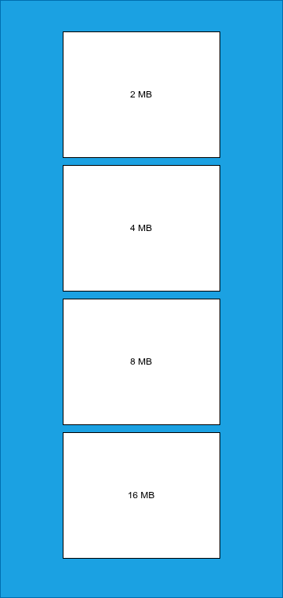

# Fusion Larger Block System



Baseado na nessecidade de alocações grandes, criamos o **Larger Block System**, alocador especializado em memoria grande, para componente como: Buffers, Dados intermediarios de trasferencia.

## - Description

Baseado no estilo [Slab](../FusionSlab/README.md), ele utiliza de *Chain List* em sua operação para poder alocar blocos de memoria.

### - Exemple Internal API

```c
#include <Internal/Memory/Fus_LargerBlocks.h>

FusLargerBlock_t larger_block = NULL;

void ToMyExempleProduct(FusInstanceMyAllocation_t* alloc) // REQUER O ALOCADOR PASSADO PELO USUARIO
{
    size_t pool_size = 1 * 1024 * 1024; // 1 MB
    if (FUSI_InitLargerBlocks(alloc, &larger_block, pool_size) != FUSION_OK) {
        // ERRO PARA INIT!
        return;
    }

    void* larger_alloc = FUSI_AllocLargerBlocks(&larger_block, 4096); // 4 KB
    FUSI_FreeLargerBlocks(&larger_block, larger_alloc)
}

void ToMyExempleConsumer()
{
    FUSI_CloseLargerBlocks(&larger_block)
}
```

## - Review Files

- **Core/Memmory/fus_larger_block.c**, Version: a0.0.01
- **Internal/Memory/Fus_LargerBlock.h**, Version: a0.0.01
