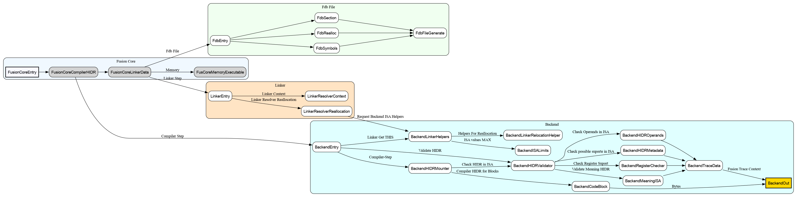

# Fusion Description



Primeiramente este e um arquivo de ideias em MarkDown, sobre o Fusion(Meu Gerador de codigo para JIT e AOT)!!!

## Mentalidade

1. Em questão de modularidade, eu basei no Vulkan, para ter uma maior controle e portabilidade!
2. Usuario e consumidor, Fusion gerenciador.
3. Core totalmente independete de ISAs.

## Arquitetura

- HIR(Hiper Intermential Represent)
- HIDR(Hiper ISA Description Represent)

### Difereça

- HIR: Representa nivel logico, quase linguagem para facilitar o uso e adotação do usuario no cotidiano.
- HIDR: Represetação e descrição de uma ISA, feito para alto controle sobre, oque e gerado por meio de instrução.

### Pipeline

```txt
(HIR) -> (Step-Lowering) -> (HIDR) -> (Backend) -> (Linker) -> (Bytes/Fdb)
```

Basicamente: Sistema recebe HIR e quebra a logica em instruções no nivel HIDR, logo apos repasa para backend, que gera bytes e forma de pacote de nessecidade, incluindo dados que não pode ser resolvido ali, como saltos para symbolos, algo que backend não resolve. Logo apos, linker recebe os pacotes e monta uma tabela com cada bloco ganhando nome + seção, logo apos linker resolve os saltos aplicando REL33 ou ABS64 nos locais que Backend marcou para resoler, com base nos simbolos conhecidos. Oque nao foi posivel resolver, pode haver erro casso o codigo deva ser executado agora ou ganha reallc no arquivo FDB.

### Sobre Backend

O Backend dentro do fusion, e recurso extremamente modular, suportando Estatico e Carregavel(Por meio de .dll/.so), backend e uma definição de ISA, ele que recebe a HIDR e define um contrato sobre o suporte que Fusion da sobre as ISAs, tem o objetivo de gerar codigo para arquitetura valida, alem de validar por meio de Backend-Valitadion-Layer, oque foi passado esta correto. Afeta diretamente como Linker resolve seus simbolos fornecendo metodos de resolver casso como REL32, ABS64 dentro do X86 como exemplo.

### Sobre Fdb

O FDB(Fusion Data Base), basicamente um formato de alta descrição focado em ser trasformado em produto final como ELF/PE, e cheio de informações e codigo gerado Fusion, vem com o objetivo de exportação de formato, ele nao definie um contrato de loader ou algo do tipo, foi feito para exportar dados para infinitas arquiteturas independente do Backend! Diferente do ELF que carrega REL32(Realocação do X86) nas costas, ele nao tem um padrao direto.

### Recursos Avançados

- HIDR: Componente de manipulação de ISA.
- Custom-Lowering: Permite mudar a transformação de HIR para HIDR, para seu gosto e formato, exige dominio sobre HIDR.
- Thread-Backend-System: Permite, paralelizar montagem de codigo, apenas na etapa: HIDR -> Backend, para gerar codgo mais rapido.
- Linker-Context: Contexto de dados do linker, geralmente sempre nessesario, mas pode ser modificado sobre controle para ter maior flexibilidade e poder na forma do linker agir.
- HIDR-Metada: Dados extras de descrição para backend.
- Block-HIDR-Metada: Dados de descrição para linker.