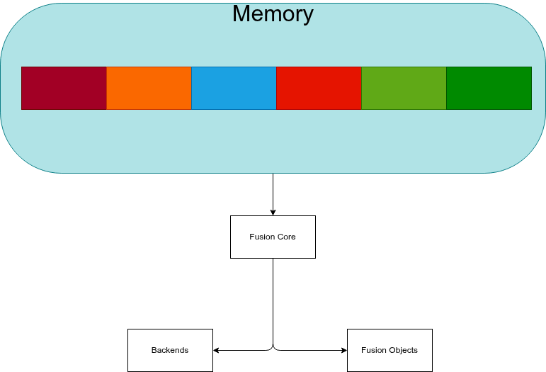

# Fusion Slab Allocator

Feito para ser compacto e rapido, evitar dores de vazamento de memoria, alem de um controle mais refinado sobre a memoria,fizemos o *Slab* inspirado no kernel linux.
Com tudo permitindo de um ambiente onde memoria dos sub-sistemas seja alocadas e controladas pelo *Fusion Core*.



## - Description

Sistema de slab originalmente projetado para suportar compatibilidade com sistema de [Handle do Fusion](../FusionHandles/README.md), com suporte de alocação pensado na compatibilidade deste sistema.
Utilizando do poder de troca de *Life-Time* dos handles, a memoria continua apenas em unico lugar dentro do slab que pode ser trocada e compatilhada utilizando handles.

### - Exemple Internal API

```c
#include <Internal/Memory/Fus_Slab.h>

// NOTA: slab é guardado em variável global apenas para exemplo.
// No Fusion real, ele estará dentro de FusInstance ou FusHandleTable.
FusSlab_t* slab = NULL;

void ToMyExempleProduct(FusInstanceMyAllocation_t* alloc) // REQUER O ALOCADOR PASSADO PELO USUARIO
{
    FusSlab_t* slab_new = FUSI_CreateSlab(alloc,inital_slots,min_slots,min_size,max_size);
    if (!slab_new) {
        // ERRO
        return;
    }

    slab = slab_new;
}

void ToMyExempleConsumer()
{
    int* a = FUSI_AllocSlab(slab,sizeof(int)); // CATEGORIZA O TAMANHO NOS SLOTS.

    *a = 90; // TEST

    FUSI_FreeSlab(slab,a);
    FUSI_DestroySlab(slab); // FINALIZA O SLAB
}
```

### - Parâmetros do Slab

- **initial_slots**: 4096 (começa com muitos slots para tamanhos pequenos)
- **min_slots**: 8 (não reduz abaixo disso, mesmo para tamanhos grandes)
- **min_size**: 8 bytes (mínimo para guardar freelist)
- **max_size**: 4096 bytes (alocações maiores vão para LargerBlocks ou malloc)

## - Review Files

- **Core/Memory/fus_slab.c**, Version: a0.0.01
- **Internal/Memory/Fus_Slab.h**, Version: a0.0.01
